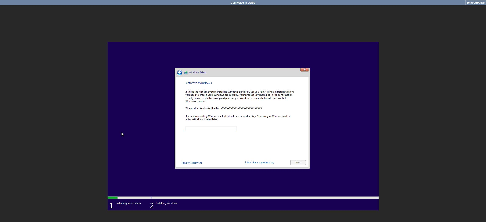
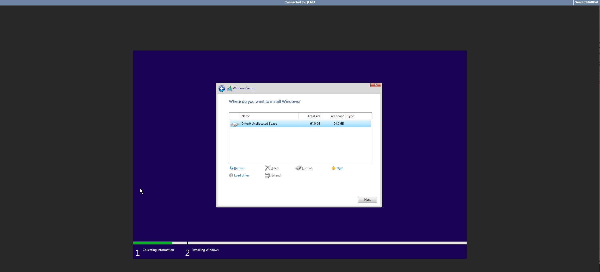
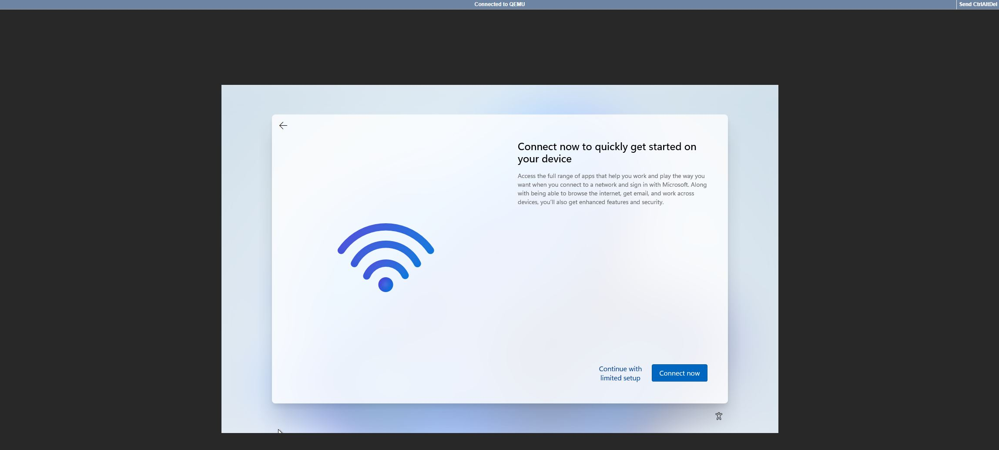

# swc_windows_container
This repository contains instructions for deploying windows system on docker. For additional details, please email at [christopher.sargent@sargentwalker.io](mailto:christopher.sargent@sargentwalker.io).

# [Dockurr Windows](https://hub.docker.com/r/dockurr/windows)

* Tested on Ubuntu Server 22.04
# Install docker
1. ssh cas@IP
2. sudo -i
3. apt update && apt upgrade -y
4. apt install apt-transport-https ca-certificates curl software-properties-common -y
5. curl -fsSL https://download.docker.com/linux/ubuntu/gpg | sudo gpg --dearmor -o /usr/share/keyrings/docker-archive-keyring.gpg
6. echo "deb [arch=$(dpkg --print-architecture) signed-by=/usr/share/keyrings/docker-archive-keyring.gpg] https://download.docker.com/linux/ubuntu $(lsb_release -cs) stable" | sudo tee /etc/apt/sources.list.d/docker.list > /dev/null
7. apt update
8. apt install docker-ce -y 
9. systemctl status docker
* Verify up and running 

# Windows container compose
10. mkdir /root/windows-docker
11. cd /root/windows-docker
12. vim windows-compose.yml
```
version: "3"
services:
  windows:
    container_name: windows
    image: dockurr/windows
    environment:
      VERSION: "win11x64"
#    volumes:
#      - ./var/win:storage
    devices:
      - /dev/kvm
    cap_add:
      - NET_ADMIN
    ports:
      - 8006:8006
    stop_grace_period: 2m
    restart: unless-stopped
```
13. docker compose -f windows-compose.yml up -d
* Note that docker compose is now part of docker and you no longer need to install docker-compose
14. docker logs windows -f
```
❯ Starting Windows for Docker v1.02...
❯ For support visit https://github.com/dockur/windows
[i] Downloading Windows media from official Microsoft servers...
[i] Downloading Windows 11...
  % Total    % Received % Xferd  Average Speed   Time    Time     Time  Current
                                 Dload  Upload   Total   Spent    Left  Speed
100  135k    0  135k    0     0   228k      0 --:--:-- --:--:-- --:--:--  228k
  % Total    % Received % Xferd  Average Speed   Time    Time     Time  Current
                                 Dload  Upload   Total   Spent    Left  Speed
100   757  100   757    0     0    863      0 --:--:-- --:--:-- --:--:--   863
  % Total    % Received % Xferd  Average Speed   Time    Time     Time  Current
                                 Dload  Upload   Total   Spent    Left  Speed
100  7976  100  7976    0     0   4409      0  0:00:01  0:00:01 --:--:--  4409
  % Total    % Received % Xferd  Average Speed   Time    Time     Time  Current
                                 Dload  Upload   Total   Spent    Left  Speed
100  9578  100  9578    0     0   3829      0  0:00:02  0:00:02 --:--:--  3828
[+] Got latest ISO download link (valid for 24 hours): https://software.download.prss.microsoft.com/dbazure/Win11_23H2_English_x64v2.iso?t=69e46a8b-aee0-4e7d-87d7-a8aba6615794&e=1705434969&h=ceaa046785587488ee9a027a392d9d678b54239091d7eb5e608cf26acc235855
######################################################################## 100.0%%0.2%
[i] Verifying integrity...
win11x64.iso: OK

[+] Successfully downloaded and verified integrity of all Windows media!
❯ Customizing ISO to remove keypress requirement during boot...

7-Zip [64] 16.02 : Copyright (c) 1999-2016 Igor Pavlov : 2016-05-21
p7zip Version 16.02 (locale=C,Utf16=off,HugeFiles=on,64 bits,4 CPUs Intel(R) Xeon(R) CPU E5-2695 v4 @ 2.10GHz (406F1),ASM,AES-NI)

Scanning the drive for archives:
1 file, 6812706816 bytes (6498 MiB)

Extracting archive: win11x64.iso
--
Path = win11x64.iso
Type = Udf
Physical Size = 6812706816
Comment = CCCOMA_X64FRE_EN-US_DV9
Cluster Size = 2048
Created = 2023-12-05 00:00:00

Everything is Ok

Folders: 85
Files: 946
Size:       6807219850
Compressed: 6812706816
Warning: creating filesystem that does not conform to ISO-9660.
Warning: Creating ISO-9660:1999 (version 2) filesystem.
Warning: ISO-9660 filenames longer than 31 may cause buffer overflows in the OS.
Warning: creating filesystem with Joliet extensions but without Rock Ridge
         extensions. It is highly recommended to add Rock Ridge.
genisoimage 1.1.11 (Linux)
Scanning unpack
Scanning unpack/support
Scanning unpack/support/logging
Scanning unpack/support/logging/en-us
Scanning unpack/sources
Scanning unpack/sources/migration
Scanning unpack/sources/migration/wtr
Scanning unpack/sources/etwproviders
Scanning unpack/sources/etwproviders/en-us
Scanning unpack/sources/en-us
Scanning unpack/sources/dlmanifests
Scanning unpack/sources/dlmanifests/microsoft-windows-networkloadbalancing-core
Scanning unpack/sources/dlmanifests/microsoft-windows-com-dtc-setup-dl
Scanning unpack/sources/dlmanifests/microsoft-windows-msmq-messagingcoreservice
Scanning unpack/sources/dlmanifests/microsoft-windows-directoryservices-adam-dl
Scanning unpack/sources/dlmanifests/microsoft-windows-winsock-core-infrastructure-upgrade
Scanning unpack/sources/dlmanifests/networking-mpssvc-svc
Scanning unpack/sources/dlmanifests/microsoft-windows-com-complus-setup-dl
Scanning unpack/sources/dlmanifests/microsoft-windows-networkbridge
Scanning unpack/sources/dlmanifests/microsoft-windows-terminalservices-licenseserver
Scanning unpack/sources/dlmanifests/microsoft-windows-internet-naming-service-runtime
Scanning unpack/sources/dlmanifests/microsoft-windows-unimodem-config
Scanning unpack/sources/dlmanifests/microsoft-windows-rasserver-migplugin
Scanning unpack/sources/dlmanifests/microsoft-windows-textservicesframework-migration-dl
Scanning unpack/sources/dlmanifests/microsoft-windows-tapisetup
Scanning unpack/sources/dlmanifests/microsoft-windows-rasconnectionmanager
Scanning unpack/sources/dlmanifests/microsoft-activedirectory-webservices-dl
Scanning unpack/sources/dlmanifests/microsoft-windows-ie-clientnetworkprotocolimplementation-migration
Scanning unpack/sources/dlmanifests/microsoft-windows-wmi-core
Scanning unpack/sources/dlmanifests/microsoft-windows-dhcpservermigplugin-dl
Scanning unpack/sources/dlmanifests/microsoft-windows-iasserver-migplugin
Scanning unpack/sources/uup
Scanning unpack/sources/uup/metadata
Scanning unpack/sources/asz
Scanning unpack/sources/asz/en-us
Scanning unpack/sources/inf
Scanning unpack/sources/sxs
Scanning unpack/sources/replacementmanifests
Scanning unpack/sources/replacementmanifests/microsoft-windows-virtualization-vmswitch
Scanning unpack/sources/replacementmanifests/hwvid-migration-2
Scanning unpack/sources/replacementmanifests/microsoft-windows-com-complus-setup
Scanning unpack/sources/replacementmanifests/microsoft-client-license-platform-service-migration
Scanning unpack/sources/replacementmanifests/microsoft-onecore-tiledatarepository
Scanning unpack/sources/replacementmanifests/networkbridge
Scanning unpack/sources/replacementmanifests/microsoft-windows-appx-deployment-server
Scanning unpack/sources/replacementmanifests/microsoft-azurestack-hci-plugin
Scanning unpack/sources/replacementmanifests/networking-mpssvc-svc
Scanning unpack/sources/replacementmanifests/microsoft-windows-textservicesframework-migration
Scanning unpack/sources/replacementmanifests/microsoft-edge-migration-plugin
Scanning unpack/sources/replacementmanifests/microsoft-windows-terminalservices-licenseserver
Scanning unpack/sources/replacementmanifests/microsoft-windows-audio-mmecore-other
Scanning unpack/sources/replacementmanifests/microsoft-windows-deviceassociationframeworkmigration
Scanning unpack/sources/replacementmanifests/microsoft-windows-mapscontrol-migration
Scanning unpack/sources/replacementmanifests/microsoft-windows-appmanagement-migration
Scanning unpack/sources/replacementmanifests/microsoft-activedirectory-webservices
Scanning unpack/sources/replacementmanifests/microsoft-windows-tcpip
Scanning unpack/sources/replacementmanifests/microsoft-windows-rasapi-mig
Scanning unpack/sources/replacementmanifests/microsoft-windows-rasserver-migplugin
Scanning unpack/sources/replacementmanifests/microsoft-windows-terminalservices-appserver-licensing
Scanning unpack/sources/replacementmanifests/microsoft-windows-security-ngc-localaccountmigplugin
Scanning unpack/sources/replacementmanifests/microsoft-windows-sxs
Scanning unpack/sources/replacementmanifests/microsoft-windows-sxs/en-us
Scanning unpack/sources/replacementmanifests/sppmig
Scanning unpack/sources/replacementmanifests/microsoft-windows-mup
Scanning unpack/sources/replacementmanifests/microsoft-windows-offlinefiles-core
Scanning unpack/sources/replacementmanifests/microsoft-windows-offlinefiles-core/en-us
Scanning unpack/sources/replacementmanifests/printing-localprinting-replacement
Scanning unpack/sources/replacementmanifests/windowssearchengine
Scanning unpack/sources/replacementmanifests/microsoft-windows-network-setup
Scanning unpack/sources/replacementmanifests/microsoft-windows-iis-rm
Scanning unpack/sources/replacementmanifests/microsoft-windows-shmig
Scanning unpack/sources/replacementmanifests/microsoft-windows-shmig/en-us
Scanning unpack/sources/replacementmanifests/microsoft-windows-pnpmigration
Scanning unpack/sources/replacementmanifests/microsoft-windows-directoryservices-adam-client
File unpack/sources/install.wim is larger than 4GiB-1.
This size can only be represented in the UDF filesystem.
Make sure that your clients support and use it.
ISO9660, Joliet, RockRidge, HFS will display incorrect size.
Scanning unpack/boot
Scanning unpack/boot/fonts
Scanning unpack/boot/en-us
Scanning unpack/boot/resources
Scanning unpack/efi
Scanning unpack/efi/microsoft
Scanning unpack/efi/microsoft/boot
Scanning unpack/efi/microsoft/boot/fonts
Scanning unpack/efi/microsoft/boot/cipolicies
Scanning unpack/efi/microsoft/boot/cipolicies/active
Scanning unpack/efi/microsoft/boot/resources
Scanning unpack/efi/boot
Writing:   Initial Padblock                        Start Block 0
Done with: Initial Padblock                        Block(s)    16
Writing:   Primary Volume Descriptor               Start Block 16
Done with: Primary Volume Descriptor               Block(s)    1
Writing:   Eltorito Volume Descriptor              Start Block 17
Size of boot image is 8 sectors -> No emulation
Size of boot image is 2880 sectors -> No emulation
Done with: Eltorito Volume Descriptor              Block(s)    1
Writing:   Enhanced Volume Descriptor              Start Block 18
Done with: Enhanced Volume Descriptor              Block(s)    1
Writing:   Joliet Volume Descriptor                Start Block 19
Done with: Joliet Volume Descriptor                Block(s)    1
Writing:   End Volume Descriptor                   Start Block 20
Done with: End Volume Descriptor                   Block(s)    1
Writing:   UDF volume recognition area             Start Block 21
Done with: UDF volume recognition area             Block(s)    3
Writing:   Version block                           Start Block 24
Done with: Version block                           Block(s)    1
Writing:   UDF pad to sector 32                    Start Block 25
Done with: UDF pad to sector 32                    Block(s)    7
Writing:   UDF main seq                            Start Block 32
Done with: UDF main seq                            Block(s)    16
Writing:   UDF second seq                          Start Block 48
Done with: UDF second seq                          Block(s)    16
Writing:   UDF integ seq                           Start Block 64
Done with: UDF integ seq                           Block(s)    2
Writing:   UDF pad to sector 256                   Start Block 66
Done with: UDF pad to sector 256                   Block(s)    190
Writing:   UDF Anchor volume                       Start Block 256
Done with: UDF Anchor volume                       Block(s)    1
Writing:   UDF file set                            Start Block 257
Done with: UDF file set                            Block(s)    2
Writing:   UDF directory tree                      Start Block 259
Done with: UDF directory tree                      Block(s)    198
Writing:   UDF file entries                        Start Block 457
Done with: UDF file entries                        Block(s)    947
Writing:   Path table                              Start Block 1404
Done with: Path table                              Block(s)    4
Writing:   Joliet path table                       Start Block 1408
Done with: Joliet path table                       Block(s)    8
Writing:   Directory tree                          Start Block 1416
Done with: Directory tree                          Block(s)    109
Writing:   Joliet directory tree                   Start Block 1525
Done with: Joliet directory tree                   Block(s)    120
Writing:   Directory tree cleanup                  Start Block 1645
Done with: Directory tree cleanup                  Block(s)    0
Writing:   The File(s)                             Start Block 1645
  0.15% done, estimate finish Mon Jan 15 20:39:39 2024
  99.97% done, estimate finish Mon Jan 15 20:29:54 2024
Total translation table size: 2048
Total rockridge attributes bytes: 0
Total directory bytes: 221618
Path table size(bytes): 2856
Done with: The File(s)                             Block(s)    3324248
Writing:   UDF Anchor end volume                   Start Block 3325893
Done with: UDF Anchor end volume                   Block(s)    1
Writing:   UDF Pad end                             Start Block 3325894
Done with: UDF Pad end                             Block(s)    150
Max brk space used e4000
3326044 extents written (6496 MB)
❯ Creating a growable disk image in qcow2 format with a size of 64G...
Formatting '/storage/data.qcow2', fmt=qcow2 cluster_size=65536 extended_l2=off preallocation=off compression_type=zlib size=68719476736 lazy_refcounts=off refcount_bits=16
❯ Installing web-based VNC client...
❯ Booting Windows using QEMU emulator version 8.1.2 ...
BdsDxe: failed to load Boot0002 "UEFI QEMU QEMU HARDDISK " from PciRoot(0x0)/Pci(0xA,0x0)/Scsi(0x0,0x0): Not Found
BdsDxe: loading Boot0001 "UEFI QEMU QEMU CD-ROM " from PciRoot(0x0)/Pci(0x5,0x0)/Scsi(0x0,0x0)
BdsDxe: starting Boot0001 "UEFI QEMU QEMU CD-ROM " from PciRoot(0x0)/Pci(0x5,0x0)/Scsi(0x0,0x0)
```
15. http://IP:8006








* Note this system has 2 CPUs and 8GiB of ram. Should deploy with 4 CPUs and 16GiB of ram to improve performance.

16. Hit shift + F10 and type  OOBE\BYPASSNRO
* Note this will force a reboot but allow you to create a local user without the network.
* Continue with limited setup





